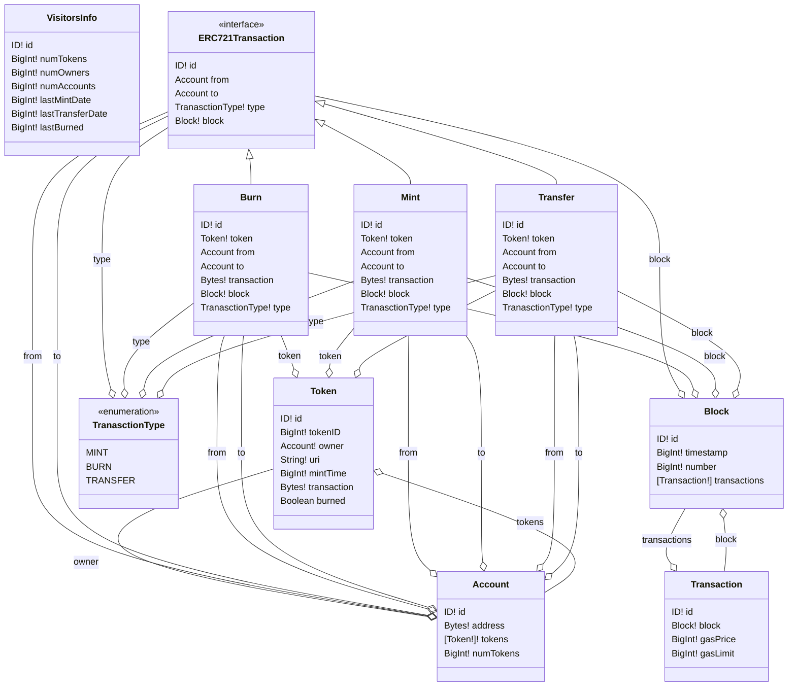

Create a Mermaid file from a schema.graphql from a subgraph for the graph protocol.

1.  npm install -g .

2.  go to schema.graphql directory and run
    mmdSchema

3.  schema.mmd created

4.  Add the Image to the README subgraph in github :)
by using 
``````
```mermaid

... <<include text generated in schema.mdd>>

```
``````
---

Another option is to copy the graphql.schema into the root of project an run

node .

Image Example


Image Example
